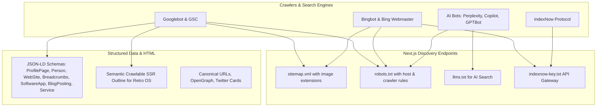

# Comprehensive SEO & SEM Strategy & Implementation Plan for Google & Bing

## 1. Executive Summary & Algorithmic Research Findings

### A. Google Search & Google Search Console (GSC) Modern Algorithmic Landscape
1. **E-E-A-T (Experience, Expertise, Authoritativeness, Trustworthiness)**:
   - Google ranking systems prioritize verifiable personal authority.
   - Requires explicit author entity linking via [`src/components/public/json-ld.tsx`](src/components/public/json-ld.tsx:1) using `@type: "ProfilePage"` and `@type: "Person"` with `sameAs` array pointing to verified external authoritative profiles (LinkedIn, GitHub, Medium, Twitter).
2. **Core Web Vitals & INP (Interaction to Next Paint)**:
   - INP replaced FID as an official Core Web Vital. Portfolio components with animations (GSAP) and tabs must maintain input response times below 200ms.
   - Images must leverage Next.js modern formats (`webp`, `avif`) with explicit aspect ratios and priority flags for LCP elements.
3. **Structured Data Rich Results**:
   - Standardizing Schema.org schemas: `ProfilePage`, `Person`, `WebSite`, `BreadcrumbList` on all nested paths, `SoftwareApplication` / `CreativeWork` for projects, and `TechArticle` / `BlogPosting` with `datePublished`, `dateModified`, `author`, `publisher`.
4. **Hydration & Crawling Architecture**:
   - The current single-page retro OS toggles apps via client state (`activeApp`). Googlebot and Bingbot crawl initial SSR HTML. An accessible, crawlable semantic DOM outline must be rendered in SSR so crawlers index all services, projects, and articles regardless of UI tab state.

---

### B. Microsoft Bing Search & Bing Webmaster Tools Landscape
1. **IndexNow Protocol (Bing & Yandex Instant Indexing)**:
   - Bing uses **IndexNow** (`https://www.indexnow.org`) to index or re-index content within seconds, bypassing standard crawler discovery latency.
   - Requires an IndexNow verification key file (e.g. `[key].txt` at site root) and an automated HTTP POST service sending changed URLs to `https://api.indexnow.org/indexnow`.
2. **Bing Webmaster Verification & Directives**:
   - Requires valid `msvalidate.01` meta tag or `BingSiteAuth.xml` file.
   - Bingbot respects the `Host` directive in [`src/app/robots.ts`](src/app/robots.ts:1).
3. **Bing Copilot / Generative Search & llms.txt**:
   - Bing Deep Search leverages vector representations and technical headings (`<h1>`, `<h2>`, `<h3>`).
   - Providing `/llms.txt` and `/llms-full.txt` provides structured markdown context for AI search engines (Copilot, Perplexity, ChatGPT Search).

---

### C. SEM (Search Engine Marketing) & Conversion Optimization
1. **Quality Score & High-Intent Landing Architecture**:
   - Google Ads & Microsoft Ads calculate Quality Score based on Landing Page Relevance, Expected CTR, and Transparency.
   - Clear conversion targets: One-click WhatsApp consultation, Email gateway, GitHub source code inspection, and Live Demo trials.
   - Service & Offer structured data (`@type: "Service"`, `@type: "Offer"`) communicating commercial capabilities.
2. **OpenGraph & Social Sharing for Paid Campaigns**:
   - Dynamic OG images and Twitter summary cards with rich preview imagery.

---

## 2. Technical System Architecture

---

## 3. Actionable Implementation Breakdown

### Task 1: Google & Bing Verification & IndexNow Protocol
- Configure valid Google Site Verification and Bing `msvalidate.01` via environment variables with safe fallbacks in [`src/app/layout.tsx`](src/app/layout.tsx:1).
- Add `public/BingSiteAuth.xml` support.
- Generate a 32-character IndexNow API key and serve it at `/[key].txt` route or public static file.
- Implement an automated Server Action / API route [`src/app/api/indexnow/route.ts`](src/app/api/indexnow/route.ts:1) that sends URL payloads to `https://api.indexnow.org/indexnow` whenever articles or projects are published, updated, or manually triggered from the Admin dashboard.

### Task 2: Advanced Dynamic Sitemap & Robots.txt Directives
- Refactor [`src/app/sitemap.ts`](src/app/sitemap.ts:1):
  - Fix default URL fallback to `https://sigitadi.dev` (eliminate `http://localhost:3000`).
  - Add `/artikel` catalog route to static routes.
  - Include `<image:image>` metadata for projects and articles so Google & Bing image search crawls project screenshots.
  - Set accurate `<lastmod>` timestamps based on database `updatedAt` / `createdAt`.
- Refactor [`src/app/robots.ts`](src/app/robots.ts:1):
  - Add `host: baseUrl` directive for Bing.
  - Define user-agent rules for `Googlebot`, `Bingbot`, `IndexNow`, and permitted AI crawlers (`PerplexityBot`, `GPTBot`, `ClaudeBot`).
  - Disallow sensitive paths (`/admin/`, `/sign-in/`, `/sign-up/`, `/api/`).

### Task 3: Comprehensive JSON-LD Structured Data (E-E-A-T & Rich Snippets)
- Update [`src/components/public/json-ld.tsx`](src/components/public/json-ld.tsx:1):
  - Add `ProfilePage` and `WebSite` schemas on the root page.
  - Add `Service` catalog schemas for available web/software development offerings.
  - Include `ContactPoint` with telephone, email, and area served.
- Add `BreadcrumbList` schema to:
  - [`src/app/(public)/proyek/page.tsx`](src/app/(public)/proyek/page.tsx:1)
  - [`src/app/(public)/proyek/[slug]/page.tsx`](src/app/(public)/proyek/[slug]/page.tsx:1)
  - [`src/app/(public)/artikel/[slug]/page.tsx`](src/app/(public)/artikel/[slug]/page.tsx:1)
- Add `SoftwareApplication` / `CreativeWork` schema to [`src/app/(public)/proyek/[slug]/page.tsx`](src/app/(public)/proyek/[slug]/page.tsx:1) including tech stack, operating system, and live demo link.
- Enhance `BlogPosting` schema in [`src/app/(public)/artikel/[slug]/page.tsx`](src/app/(public)/artikel/[slug]/page.tsx:1) with `publisher`, `inLanguage`, and article body word count.

### Task 4: Retro OS Crawler Semantic HTML & Internal Link Graph
- Because [`src/components/public/os/os-desktop-manager.tsx`](src/components/public/os/os-desktop-manager.tsx:1) only renders the active tab in the browser canvas, inject an accessible, server-rendered `<section className="sr-only" aria-label="Sitemap Konten Portofolio">` in [`src/app/(public)/page.tsx`](src/app/(public)/page.tsx:1).
- This ensures Googlebot and Bingbot instantly read:
  - All services and descriptions
  - Direct crawlable `<a href="/proyek/...">` links to all projects
  - Direct crawlable `<a href="/artikel/...">` links to all articles
  - Contact links and testimonials
- Add direct `<Link href={`/proyek/${project.slug}`}>` into the project cards in [`src/components/public/featured-projects-section.tsx`](src/components/public/featured-projects-section.tsx:1) so crawlers follow project URLs naturally.

### Task 5: Dedicated Articles Catalog Route (`/artikel`)
- Create [`src/app/(public)/artikel/page.tsx`](src/app/(public)/artikel/page.tsx:1) providing a dedicated indexable catalog for all published articles.
- Include SEO metadata, OpenGraph tags, canonical link, and `CollectionPage` structured data.
- Add a direct link to `/artikel` in navigation headers and sitemaps.

### Task 6: Canonical URL & Metadata Hygiene across Dynamic Routes
- Refactor [`src/lib/seo.ts`](src/lib/seo.ts:1) to generate route-specific canonical links and comprehensive keywords.
- Add canonical URLs (`alternates: { canonical: ... }`) to:
  - [`src/app/(public)/proyek/page.tsx`](src/app/(public)/proyek/page.tsx:1)
  - [`src/app/(public)/proyek/[slug]/page.tsx`](src/app/(public)/proyek/[slug]/page.tsx:1)
  - [`src/app/(public)/artikel/[slug]/page.tsx`](src/app/(public)/artikel/[slug]/page.tsx:1)

### Task 7: AI Search Engine Optimization (llms.txt)
- Create `public/llms.txt` following the standard for LLM crawlers (Perplexity, Copilot, ChatGPT Search).
- Provide concise summaries of Sigit Adi Pranoto's technical portfolio, project catalog links, article links, and contact channels.

### Task 8: SEM Conversion Triggers & Speed Optimization
- Enhance conversion paths on contact buttons (direct WhatsApp CTA, email CTA with pre-filled subject).
- Ensure image elements specify `loading="lazy"` or `priority` where applicable to safeguard Core Web Vitals (LCP < 2.5s, INP < 200ms).
